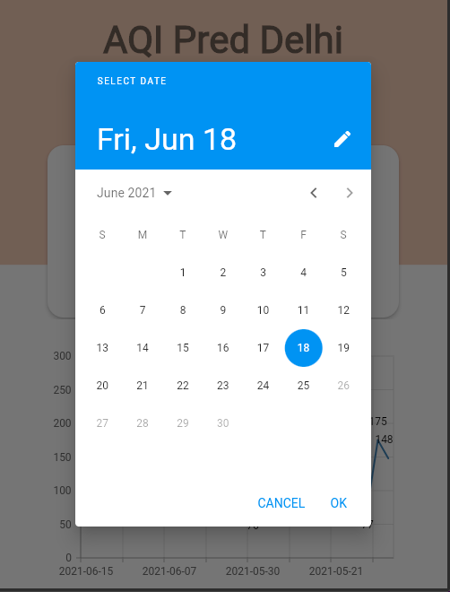
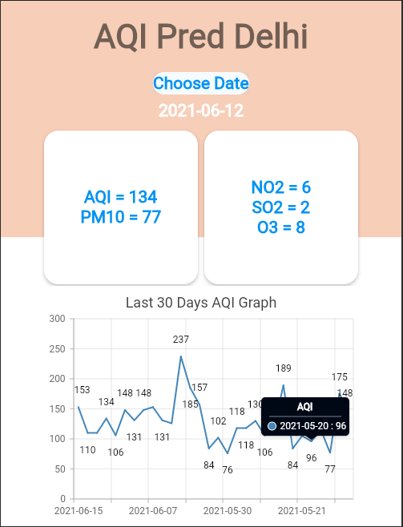

Built a flutter app for Android and ios Which predicts AQI and other pollutants such as NO2,SO2 etc of Delhi pto next 7 days.

1. Used API from my own built website AQI Pred delhi github [link](https://github.com/vc8006/aqi_pred)
2. Search date option by which one can see data for last 5 years 
3. Implemented Syncfusion charts to visualize last 30 days AQI 

